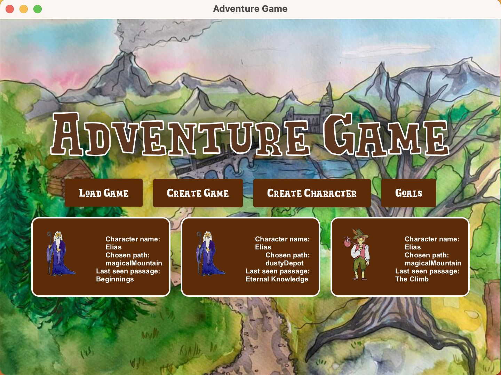

# Adventuregame

## Getting started

###
To run the program, you will need Java 17, as well as the JavaFX SDK. You can download Java 17 [here](https://www.oracle.com/java/technologies/downloads/#java17) and the JavaFX SDK [here](https://gluonhq.com/products/javafx/). You will also need a Java IDE, such as [IntelliJ IDEA](https://www.jetbrains.com/idea/) or [Eclipse](https://www.eclipse.org/ide/).

We advise that you run the program through an IDE, using maven. 

### Running the program
To run the program, you simply pull the git repository to your computer. 

Then, you open the project in your IDE.

## Navigation
The program is navigated using the mouse. You click on the buttons to choose your path.

### Main Menu 

### Game

## Acknowledgements
All art is painted by hand by our personal artist designer, Frid.
